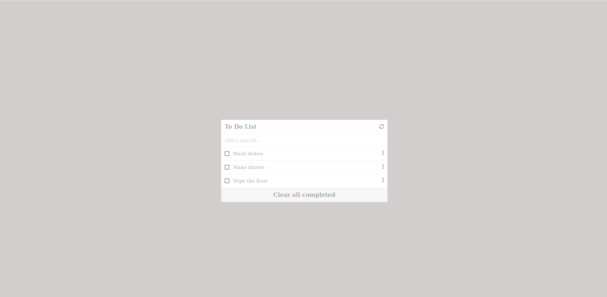

# To Do List

> The "To do List" is a Microverse project where we get to practice all the things we've learned during the week. The "To Do List" project was made with webpack, it uses an HTML template to creat the /dis HTML index file. Also, when the window loads it will call a function that fills the list with the items on an array.

## Built With

- HTML
- CSS
- javaScript
- webpack

To get a local copy up and running follow these simple example steps.
Run:
- `git clone git@github.com:JbirdL86/webpack-project.git`
- `cd webpack-project`
-`Install node_modules, run npm install and install the latest node version`
-`Install webpack package`
- Open ./dist/index.html in browser

## Live Demo

[Live Demo Link](https://jbirdl86.github.io/webpack-project/dist/)

## Authors

👤 **Author**

- Github: [@githubhandle](https://github.com/JbirdL86)
- Twitter: [@twitterhandle](https://twitter.com/JuanLui06498455)
- Linkedin: [linkedin](https://www.linkedin.com/in/juan-luis-0551921aa/)

## 🤝 Contributing

Contributions, issues, and feature requests are welcome!

Feel free to check the [issues page](https://github.com/JbirdL86/webpack-project/issues).

## Show your support

Give a ⭐️ if you like this project!

## Acknowledgments

- Microverse
- Figma 

## 📝 License

This project is [MIT](./MIT.md) licensed.